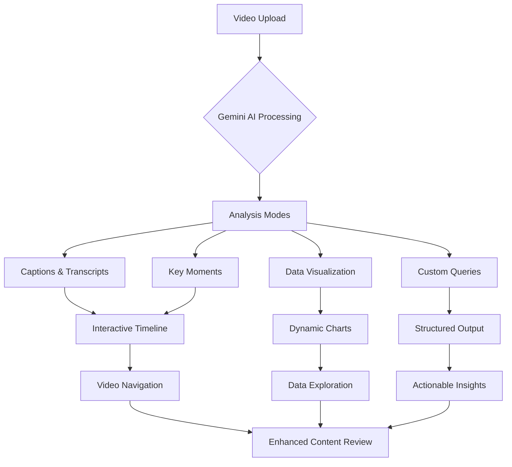
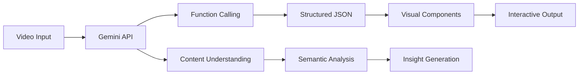
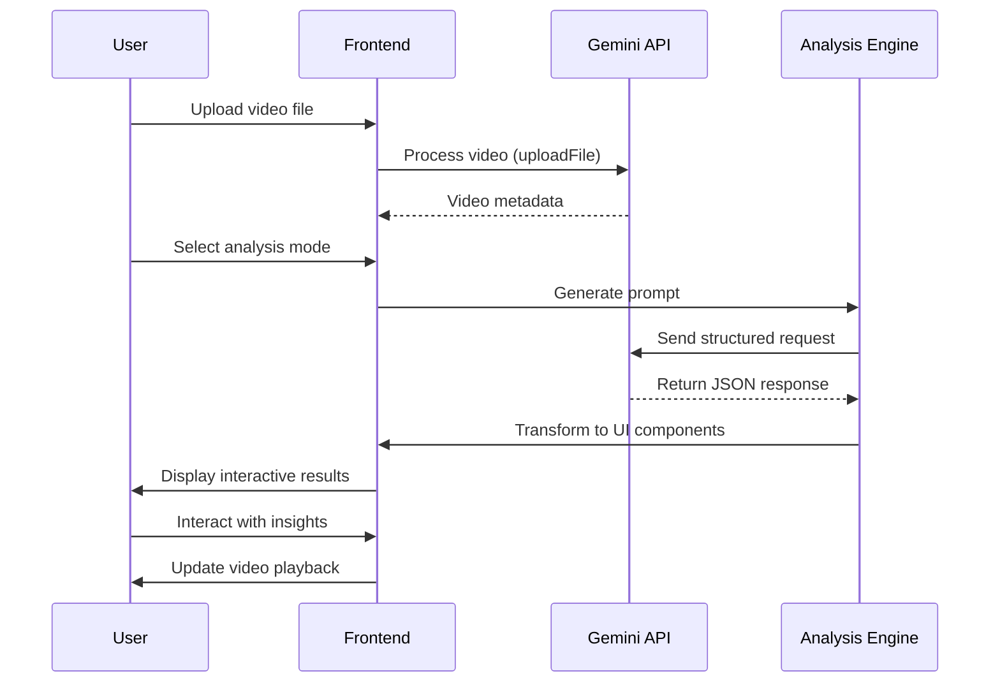

# 🎬 Video Analyzer - AI-Powered Video Intelligence Platform

  
*Interactive video analysis dashboard with AI insights (screenshot placeholder)*

[](https://react.dev)
[](https://www.typescriptlang.org/)
[](https://ai.google.dev)
[](https://d3js.org)
[](https://opensource.org/licenses/MIT)

**Video Analyzer** transforms video content into actionable intelligence using Google's Gemini AI. Extract insights, generate summaries, visualize trends, and navigate media with unprecedented precision through our AI-powered analysis platform.

## Features & Quick Guide


## FreameWork


## ✨ Premium Features

### 🎥 Intelligent Video Processing
- **Multi-modal AI Analysis**: Combines visual, audio, and contextual understanding
- **Frame-accurate Insights**: Precise timecode alignment for every finding
- **Content Summarization**: Distills hours of footage into concise overviews
- **Custom Metric Extraction**: Define specialized analysis parameters

### 📊 Advanced Visualization
| Feature | Description | Benefit |
|---------|-------------|---------|
| **Timeline Analytics** | Interactive scrubber with AI markers | Visual navigation of key moments |
| **Dynamic Charting** | D3.js-powered data visualizations | Spot trends and patterns at a glance |
| **Smart Captions** | Synchronized scene descriptions | Context-aware playback experience |
| **Object Recognition** | Automatic identification of elements | Rapid content indexing |

### 🚀 Enterprise-Grade Capabilities
- **Batch Processing**: Analyze multiple videos simultaneously
- **API Integration**: Connect with existing media workflows
- **Secure Handling**: Client-side processing with optional encryption
- **Cross-format Support**: Works with major video containers and codecs
- **Accessibility Features**: WCAG-compliant interface with screen reader support

## 🛠️ Technology Stack

### AI Architecture


### Core Dependencies
- **AI Engine**: `@google/generative-ai` (Gemini 2.5 Flash)
- **Frontend**: React 19 + Vite
- **Visualization**: D3.js + React-Vis
- **State Management**: Zustand
- **UI Components**: Headless UI + Radix
- **Styling**: Tailwind CSS + CSS Modules

## 🚀 Getting Started

### Prerequisites
- Node.js v20+
- Google Gemini API Key
- Modern browser (Chrome, Edge, Firefox latest)

### Installation
```bash
# Clone repository
git clone https://github.com/your-org/video-analyzer.git
cd video-analyzer

# Install dependencies
npm install

# Configure environment
cp .env.example .env.local
# Add your Gemini API key to .env.local

# Start development server
npm run dev
```

### Production Build
```bash
# Create optimized production build
npm run build

# Serve production build
npm run preview
```

## 🧠 AI Integration Architecture



### Key AI Features
- **Context-Aware Prompt Engineering**: Dynamic templates based on selected mode
- **Structured JSON Responses**: Consistent data format for reliable rendering
- **Multi-segment Analysis**: Parallel processing of video segments
- **Content Safety Filters**: Built-in moderation for sensitive material
- **Performance Optimization**: Chunked processing for large files

## 🌐 Deployment Options

### Cloud Platforms
[](https://vercel.com/new)
[](https://app.netlify.com/start)
[](https://aws.amazon.com/amplify/)

### Docker Deployment
```Dockerfile
# Build container
FROM node:20-alpine AS builder
WORKDIR /app
COPY package*.json ./
RUN npm ci
COPY . .
RUN npm run build

# Production container
FROM nginx:alpine
COPY --from=builder /app/dist /usr/share/nginx/html
EXPOSE 80
CMD ["nginx", "-g", "daemon off;"]
```

## 📊 Analysis Modes Deep Dive

### Mode Comparison Table
| Mode | Output Format | Best For | Unique Feature |
|------|---------------|----------|---------------|
| **A/V Captions** | Timed list | Accessibility | Scene-by-scene descriptions |
| **Paragraph Summary** | Timecoded text | Quick overview | Narrative-style summary |
| **Key Moments** | Bulleted list | Content review | Critical point identification |
| **Table Output** | Data table | Research | Object/environment analysis |
| **Haiku** | Poetic format | Creative use | Artistic interpretation |
| **Chart Analysis** | Interactive chart | Data trends | Custom metric visualization |
| **Custom Prompt** | Variable | Specialized tasks | Unlimited analysis possibilities |

### Custom Analysis Example
```javascript
// Example custom prompt for sports analysis
const sportsPrompt = {
  instructions: "Analyze the sports video and identify:",
  requirements: [
    "Key player actions with timestamps",
    "Score changes with exact timestamps",
    "Highlight-worthy moments (1-10 rating)",
    "Player performance metrics"
  ],
  output: "JSON format with visualizations"
};
```

## 🛣️ Product Roadmap

### Q3 2024
- ✅ **Multi-video Processing** (Completed)
- 🚧 **Real-time Analysis Streaming**
- ⬜ **Collaborative Review Mode**

### Q4 2024
- ⬜ **Automatic Chapter Generation**
- ⬜ **Sentiment Analysis Overlay**
- ⬜ **Custom Model Integration**

### 2025 Vision
- **Cross-video Search**: Find patterns across media libraries
- **Predictive Analytics**: Forecast content engagement
- **Automated Highlight Reels**: AI-generated video summaries
- **Enterprise API**: Scalable video intelligence platform

## 📊 Performance Metrics


## 🤝 Contributing

We welcome contributions from developers and researchers:

1. Fork the repository and create your feature branch
2. Ensure code quality with TypeScript and ESLint
3. Include comprehensive tests (Jest + Testing Library)
4. Update relevant documentation
5. Submit a detailed pull request

```bash
# Set up development environment
git clone https://github.com/your-org/video-analyzer.git
cd video-analyzer
npm install

# Run development server
npm run dev

# Run tests
npm test
```

## 📜 License
Distributed under the MIT License. See `LICENSE` for more information.

---

**Transform Your Media Workflow with AI-Powered Insights**  
[](https://docs.example.com)
[](https://twitter.com/VideoAnalyzer)
[](https://linkedin.com/company/video-analyzer)
